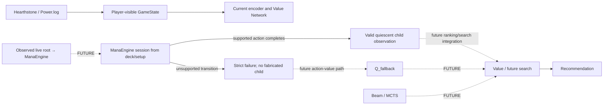

# ManaMind

ManaMind is a desktop Hearthstone adviser: it observes a player-visible position and recommends legal lines of play. It does not automate gameplay.

## Authoritative documents

| Document | Purpose |
|---|---|
| [AGENTS.md](AGENTS.md) | Working rules and instruction authority |
| [Partial simulator architecture](docs/PARTIAL_SIMULATOR_ARCHITECTURE.md) | Implemented boundaries, unknown-state strategy, accepted targets and future roadmap |
| [Capability-package process](docs/CAPABILITY_PACKAGE_PROCESS.md) | Card-support workflow, implementation kinds and proposed CI guardrail |
| [Package proposal template](docs/CAPABILITY_PACKAGE_PROPOSAL_TEMPLATE.md) | Required design record before new engine/generator card support |
| [Standard registry](docs/STANDARD_REGISTRY.md) | Pool/dependency contracts, admission gates and snapshot updates |
| [RosettaStone integration](docs/ROSETTASTONE_INTEGRATION.md) | Reference backend build, bridge API and execution evidence |
| [Real match data](docs/REAL_MATCH_DATA.md) | Local Power.log capture/import and match-level dataset preparation |
| [Live bridge](docs/LIVE_BRIDGE.md) | Trusted LIVE state, read-only experimental policy ranking and one-command local match collection |

Current pool and coverage facts come from the profile-selected registry/report, not a copied Markdown count. [Historical records](docs/history/README.md) document experiments and scoped evidence; their old queues, resume instructions and training permissions are inactive.

## Product specification and current architecture

ManaEngine is the primary simulator for forward rules development. It owns an
isolated internal state and exports completed observations through an adapter
to ManaMind's player-visible `GameState`. It is an actively developed,
bounded simulator, not production-complete. RosettaStone remains available for
reference, regression/parity, historical implementation and explicitly used
evidence/tooling.



**Implemented:** player-visible domain state, metadata catalog/vocabulary,
state encoding, Value Network, labeled-data pipeline and inference; the
ManaEngine deck-session adapter; RosettaStone native bridge and a separate
experimental action policy and a console LIVE runner that ranks complete trusted SELF menus with
the fixed real-action ML-1C checkpoint while collecting completed matches. The ManaEngine accepts only supported transitions
and fails closed when a transition cannot be modeled safely. Power.log capture
and import produce gameplay data, but there is no automatic comparison of a
real replay against ManaEngine rules.

**Accepted target / future:** an unsimulatable legal action may eventually be
ranked by an action-conditioned value fallback without inventing a child state.
`Q_fallback`, an arbitrary observed-live-state importer, live simulator search,
Beam/MCTS and a recommendation UI are not implemented. Full Standard remains
the canonical coverage target, but near-complete Hearthstone simulation is not
a prerequisite for every future ML experiment. Canonical training still
requires valid trajectories and its applicable rules, closure, action,
observation, session and match gates. Historical five-deck lists remain
regression controls.

### Observation and model contracts

- Orient every state to SELF and OPPONENT. Include SELF hand, public entities, resources and explicitly revealed opponent cards; never hidden hand identities, deck order, future draws or RNG outcomes.
- `GameState` requires `turn_number`, `active_player` (`SELF`/`OPPONENT`) and both player observations; each player requires `hero_health`. Minions and Locations share a seven-slot board with preserved positions.
- `CardFeatures` retains base cost/attack/health/durability separately from optional `current_cost`, `current_attack`, `current_health`, `current_durability`. Effective accessors serve gameplay consumers; missing values and unknown booleans remain distinguishable from zero/false.
- Encoding uses identity/category embeddings, structured numeric/mechanic/entity features and missing-value masks. It preserves ordered SELF hand and separate minion/Location zones. Numeric scaling is signed `log1p`, clipped at 10,000. `STATE_ENCODING_SCHEMA_VERSION` in `src/manamind/encoding/state_encoder.py` is authoritative; schema 16 is the current value. Feature and schema changes invalidate incompatible checkpoints; do not copy old feature counts into documentation.
- `hero_power_ready` represents observed exhaustion state, not a complete legal-use predicate; missing log tags remain unknown. Location activation is unknown unless the source can establish it.
- The Value Network shares an entity encoder, uses masked mean/max zone pooling and a global-feature MLP, then returns a win/loss logit. Sigmoid estimates `P(SELF eventually wins | visible GameState)`; targets are win 1.0, loss 0.0, draw 0.5.
- An ID absent from the saved vocabulary maps to its shared unknown identity index; available visible numeric/category/mechanic features can still carry information. The current vocabulary does not encode whether an unknown index represents a newly introduced identity or a known token absent from that checkpoint. Report unknown IDs to callers. A richer identity-status split is a target, not implemented.
- Older value checkpoints are rejected when their state schema does not match. Checkpoints store vocabulary/catalog, model config/weights, feature names, normalization and schema. Inference uses the saved catalog; added metadata cannot reorder trained vocabulary.
- The separate policy scores currently legal actions from visible state, ordered hand and semantic action descriptors. Engine entity IDs only apply actions. Both seats share the stochastic policy; terminal rewards are +1/-1/0. Its current checkpoint action schema is `POLICY_ACTION_SCHEMA_VERSION = 4` in `src/manamind/models/policy.py`. Policy logits are action-selection scores, not win probabilities or Q-values. Policy checkpoints and compatibility rules are separate from the Value Network.

### Data and result interpretation

JSONL records contain `schema_version`, `game_id`, `sample_id`, `perspective`, `source`, `state`, `target`. Split whole matches by `game_id`; keep both perspectives of a match together. Do not coerce missing required schema fields.

Synthetic labels are a pipeline demonstration. Weak-policy simulator rollouts and historical Mother Drake/five-deck experiments do not demonstrate general Hearthstone strength or authorize new training. Scoped evidence and full-profile admission are separate.

Device selection is CUDA → MPS → CPU. Preserve CPU support. Preserve all existing datasets/checkpoints; use new output filenames. Training/evaluation commands are available tools, not the next maintenance action.

## Clone and install

```powershell
git clone --recurse-submodules https://github.com/MaksimOrekhov/manamind.git
cd manamind
python -m venv .venv
.\.venv\Scripts\Activate.ps1
python -m pip install -e ".[dev,replays]"
```

Use Python 3.12 or newer as specified by `pyproject.toml`. RosettaStone is pinned to a published commit in the user-owned fork via `.gitmodules`/gitlink. Engine changes are already in that commit; do not apply the old integration patch after cloning.

Python source tests do not require a native build. Native simulator commands require the separately configured toolchain described in the integration guide.

## Entry points

| File | Purpose |
|---|---|
| `encode_example.py`, `model_example.py` | Encoding/forward-pass examples |
| `generate_synthetic.py`, `train_value.py` | Synthetic demonstration or explicitly selected labeled dataset |
| `predict_state.py` | Inference using a compatible saved value checkpoint |
| `benchmark_inference.py` | Single-state and batch latency |
| `train_selfplay.py`, `evaluate_policy.py` | Separate experimental policy; use only under an authorized profile/pilot |
| `scripts/import_power_logs.py`, `scripts/prepare_real_dataset.py` | Local real-match intake/preparation |
| `scripts/import_policy_power_log.py`, `scripts/audit_real_policy_dataset.py` | Separate real SELF action labels and policy-data audit |
| `scripts/smoke_real_policy.py` | Explicitly requested bounded policy plumbing smoke |
| `scripts/run_manamind.py` | One-command read-only LIVE policy ranking, replay recording and raw match collection |
| `scripts/replay_live_recommendations.py` | Offline policy ranking replay and ML-1B encoding parity check |
| `configs/value_v1.yaml` | Value-model/training defaults |
| `configs/standard_profile.json` | Pinned Standard input/output/evidence identities |

From the repository root, source verification commands are:

```powershell
.\.venv\Scripts\python.exe -m ruff check src tests scripts
.\.venv\Scripts\python.exe scripts/check_generated_artifacts.py
.\.venv\Scripts\python.exe -m pytest -q
```

The regeneration check rebuilds profile outputs, generated declarations and registry reports, rejecting drift or duplicate ownership. GitHub Actions runs source checks on Linux and Windows with recursive submodules. Native checks remain separate; CI does not train models.

## Project map

- `src/manamind/domain`, `cards`: observations, metadata and vocabulary.
- `src/manamind/encoding`, `models`: tensor encoding and Value Network.
- `src/manamind/training`, `inference`: dataset/checkpoint pipelines and prediction.
- `src/manamind/integrations/rosettastone`: simulator adapter, rollouts and policy.
- `integrations/rosettastone/card_rules`: reviewed declarations, manifests and scoped evidence.
- `scripts/card_rules`: composition validation, generic operations and custom emitters.
- `data/samples`: controlled fixtures and historical decklists.
- `reports`: generated coverage and dated experiment outputs.
