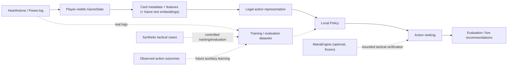

# ManaMind

ManaMind is a desktop Hearthstone adviser: it observes a player-visible position and ranks the legal actions with its own local neural network. It does not automate gameplay (no mouse movement, clicks or game actions).

**Strategy: Model-first.** The model learns from real logs, controlled synthetic tactical cases and, later, observed action outcomes. The main scenario is 1–2 user decks in current Standard. Current priorities and stage gates: [docs/MODEL_FIRST_ROADMAP.md](docs/MODEL_FIRST_ROADMAP.md).

## Authoritative documents

| Document | Purpose |
|---|---|
| [AGENTS.md](AGENTS.md) | Working rules and instruction authority |
| [Model-first roadmap](docs/MODEL_FIRST_ROADMAP.md) | The only source of current priorities, stage gates and experiment principles |
| [Policy representation](docs/POLICY_REPRESENTATION.md) | Policy v1/v2 input contracts |
| [Real match data](docs/REAL_MATCH_DATA.md) | Local Power.log capture/import and match-level dataset preparation |
| [Live bridge](docs/LIVE_BRIDGE.md) | Trusted LIVE state, read-only policy ranking and local match collection |
| [Evidence pipeline](docs/EVIDENCE_PIPELINE.md) | Observed-consequence extraction from Power.log |
| [ManaEngine README](experiments/manaengine/README.md), [admission](docs/MANAENGINE_ADMISSION.md), [partial-simulator architecture](docs/PARTIAL_SIMULATOR_ARCHITECTURE.md), [Standard registry](docs/STANDARD_REGISTRY.md), [capability-package process](docs/CAPABILITY_PACKAGE_PROCESS.md) | **Frozen optional component** (simulator and card-support process). Read only for a task that concerns ManaEngine |

[Historical records](docs/history/README.md) and dated `reports/` document earlier experiments (including the retired RosettaStone/Simulator-first phase); their old queues, resume instructions and training permissions are inactive.

## Architecture



| Status | Components |
|---|---|
| **IMPLEMENTED** | Player-visible `GameState`; card catalog/vocabulary; state encoder (schema 16); Policy v1 (ID-based) and Policy v2 (structural entity representation) with checkpoints; real-action dataset import, audit and match-level splits; Power.log capture, parsing and observation extraction; LIVE runner that read-only ranks complete trusted SELF menus with a fixed checkpoint and collects completed matches; Value Network and its data pipeline (separate from Policy); pinned Standard catalog |
| **EXPERIMENTAL** | ManaEngine: independent, bounded deterministic simulator that fails closed on unsupported transitions (development frozen); consequence-evidence extraction (`src/manamind/evidence`); synthetic data generators for pipeline checks |
| **PLANNED** | Evaluation Baseline, synthetic tactical training, Text/Hybrid Policy, observable-consequence prediction (mechanics model), independent practical-quality check, Live Shadow Mode — see the roadmap. None of these is implemented yet |

Full Standard simulator coverage is **not** required for training or for live inference on real legal actions. ManaEngine's strict rules (determinism, fail-closed behaviour, hidden-information boundary) are unchanged; see its README.

## Observation and model contracts

- Orient every state to SELF and OPPONENT. Include SELF hand, public entities, resources and explicitly revealed opponent cards; never hidden hand identities, deck order, future draws or RNG outcomes.
- `GameState` requires `turn_number`, `active_player` (`SELF`/`OPPONENT`) and both player observations; each player requires `hero_health`. Minions and Locations share a seven-slot board with preserved positions.
- `CardFeatures` retains base cost/attack/health/durability separately from optional `current_cost`, `current_attack`, `current_health`, `current_durability`. Effective accessors serve gameplay consumers; missing values and unknown booleans remain distinguishable from zero/false.
- Encoding uses identity/category embeddings, structured numeric/mechanic/entity features and missing-value masks. It preserves ordered SELF hand and separate minion/Location zones. Numeric scaling is signed `log1p`, clipped at 10,000. `STATE_ENCODING_SCHEMA_VERSION` in `src/manamind/encoding/state_encoder.py` is authoritative; schema 16 is the current value. Feature and schema changes invalidate incompatible checkpoints; do not copy old feature counts into documentation.
- `hero_power_ready` represents observed exhaustion state, not a Mana, target or legal-use predicate; it is True/False only from an explicit `EXHAUSTED` tag or, for SELF decisions, a server statement in the options message (a validated Hero Power option, or `REQ_NOT_EXHAUSTED_HERO_POWER`), and stays None otherwise or when sources conflict. `hero_frozen` is True/False only from an explicit `FROZEN` tag (a missing tag is unknown, not False) and `hero_freeze_turns_remaining` is not extracted. `hero_max_health` is the hero's directly observed maximum Health (the `HEALTH` tag; 40 is valid) while `hero_health` stays current Health; None means not observed and is never replaced by 30, a class default or a clamp. Location activation is unknown unless the source can establish it.
- The Value Network shares an entity encoder, uses masked mean/max zone pooling and a global-feature MLP, then returns a win/loss logit. Sigmoid estimates `P(SELF eventually wins | visible GameState)`; targets are win 1.0, loss 0.0, draw 0.5.
- An ID absent from the saved vocabulary maps to its shared unknown identity index; available visible numeric/category/mechanic features can still carry information. The current vocabulary does not encode whether an unknown index represents a newly introduced identity or a known token absent from that checkpoint. Report unknown IDs to callers. A richer identity-status split is a target, not implemented.
- Older value checkpoints are rejected when their state schema does not match. Checkpoints store vocabulary/catalog, model config/weights, feature names, normalization and schema. Inference uses the saved catalog; added metadata cannot reorder trained vocabulary.
- The separate policy scores currently legal actions from visible state, ordered hand and semantic action descriptors. Engine entity IDs only apply actions. Both seats share the stochastic policy; terminal rewards are +1/-1/0. Its current checkpoint action schema is `POLICY_ACTION_SCHEMA_VERSION = 4` in `src/manamind/models/policy.py`. Policy logits are action-selection scores, not win probabilities or Q-values. Policy checkpoints and compatibility rules are separate from the Value Network.

## Data and result interpretation

JSONL records contain `schema_version`, `game_id`, `sample_id`, `perspective`, `source`, `state`, `target`. Split whole matches by `game_id`; keep both perspectives of a match together. Do not coerce missing required schema fields.

Synthetic labels are a pipeline demonstration. Weak-policy simulator rollouts and historical Mother Drake/five-deck experiments do not demonstrate general Hearthstone strength or authorize new training. Scoped evidence and full-profile admission are separate.

Device selection is CUDA → MPS → CPU. Preserve CPU support. Preserve all existing datasets/checkpoints; use new output filenames. Training/evaluation commands are available tools, not the next maintenance action.

## Clone and install

```powershell
git clone https://github.com/MaksimOrekhov/manamind.git
cd manamind
python -m venv .venv
.\.venv\Scripts\Activate.ps1
python -m pip install -e ".[dev,replays]"
```

Use Python 3.12 or newer as specified by `pyproject.toml`. No Git submodules and no native toolchain are needed: Python source checks, Policy inference, Power.log parsing and the LIVE pipeline run from a plain clone. The optional ManaEngine native build (CMake, a C++20 compiler, pybind11) is described in [experiments/manaengine/README.md](experiments/manaengine/README.md).

## Entry points

| File | Purpose |
|---|---|
| `encode_example.py`, `model_example.py` | Encoding/forward-pass examples |
| `generate_synthetic.py`, `train_value.py` | Synthetic demonstration or explicitly selected labeled Value dataset |
| `predict_state.py` | Inference using a compatible saved value checkpoint |
| `benchmark_inference.py` | Single-state and batch latency |
| `scripts/import_power_logs.py`, `scripts/prepare_real_dataset.py` | Local real-match intake/preparation |
| `scripts/import_policy_power_log.py`, `scripts/audit_real_policy_dataset.py` | Real SELF action labels and policy-data audit |
| `scripts/train_real_policy.py`, `scripts/smoke_real_policy.py` | Policy training and bounded plumbing smoke; run only when an experiment explicitly calls for it |
| `scripts/run_manamind.py` | One-command read-only LIVE policy ranking, replay recording and raw match collection |
| `scripts/replay_live_recommendations.py` | Offline policy ranking replay and ML-1B encoding parity check |
| `configs/value_v1.yaml` | Value-model/training defaults |
| `configs/standard_profile.json` | Pinned Standard catalog inputs (and a pointer to a frozen historical registry) |

The former RosettaStone self-play entry points (`train_selfplay.py`, `evaluate_policy.py`) were removed in MODEL-FIRST-MIGRATION-1; see [reports/model_first_migration_1/README.md](reports/model_first_migration_1/README.md).

From the repository root, source verification commands are:

```powershell
.\.venv\Scripts\python.exe -m ruff check src tests scripts
.\.venv\Scripts\python.exe scripts/check_generated_artifacts.py
.\.venv\Scripts\python.exe -m pytest -q
```

`check_generated_artifacts.py` rebuilds the Standard roots snapshot and catalog offline from the pinned HearthstoneJSON snapshot and rejects drift. GitHub Actions runs these on Linux and Windows without submodules; a separate workflow builds and tests ManaEngine. CI does not train models.

## Project map

- `src/manamind/domain`, `cards`: observations, metadata and vocabulary.
- `src/manamind/encoding`, `models`: tensor encoding, Policy v1/v2 and the Value Network.
- `src/manamind/training`, `inference`: dataset/checkpoint pipelines and prediction.
- `src/manamind/integrations/powerlog`, `src/manamind/live`: Power.log parsing/import and the LIVE pipeline.
- `src/manamind/evidence`: observed-consequence extraction.
- `src/manamind/integrations/manaengine`, `experiments/manaengine`: optional frozen simulator and its native sources.
- `data/samples`: controlled fixtures and historical decklists.
- `docs/history`, `reports`: archived experiment outputs and dated reports (evidence only).
