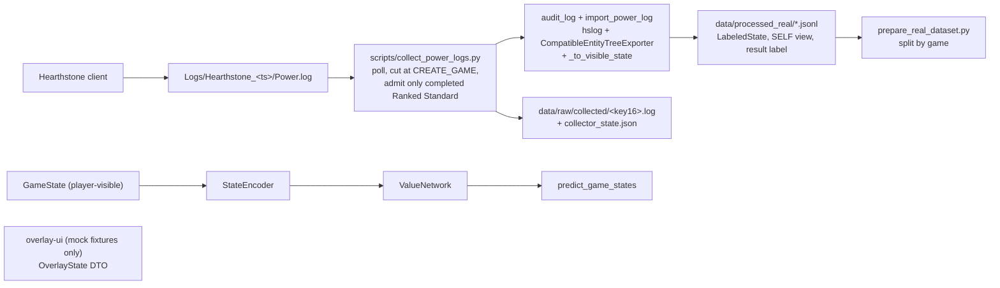
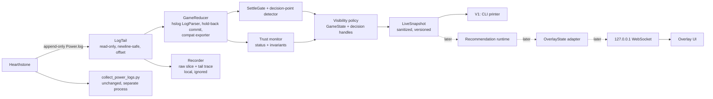

# LIVE-0A — Real-time Hearthstone bridge architecture audit

**Verdict: `LIVE_BRIDGE_AUDIT_READY`**

Mode: read-only research and architecture audit. No production code, collector, importer, ManaEngine, training or overlay file was changed. Only files under `reports/live_integration/` were added.

Companion file: [LIVE_FIELD_CAPABILITY_MATRIX.md](LIVE_FIELD_CAPABILITY_MATRIX.md) (field-by-field comparison; §6 below summarizes it).

---

## 0. Provenance and method

| Item | Value |
|---|---|
| ManaMind base | `origin/main` = `55f95a97ff5cddbc97669d2e61a05c77f8c8ffe6` ("docs(manaengine): record phase 4k1b completion and hosted evidence"). Re-checked unchanged at the end of the task. |
| Audit branch | `audit/live-realtime-bridge`, created from that SHA. |
| Overlay design read | `origin/work/ui-overlay-shell` @ `a995b7e`, files `apps/overlay-ui/src/overlay/types.ts` and `apps/overlay-ui/README.md` (read through `git show`, not checked out). |
| HDT | `HearthSim/Hearthstone-Deck-Tracker` @ `3f2d469cb0b7bd0150c280c59c149f2ea7ce5153`, "v1.58.7", 2026-10-05, default branch `master`. Locally installed HDT is 1.58.6, one patch behind. |
| HDT wiki | `…/Hearthstone-Deck-Tracker.wiki.git` @ `ae0969aaae01bff35d8e2f5686a4c879d1ce34c5` (2026-08-22): `Creating-Plugins.md`, `API-Reference.md`, `Setting-up-the-log.config.md`. |
| hslog | `HearthSim/python-hslog` HEAD `015c0dec197779c90cd3131ecda2c990292342b6` (2026-08-15, "fix: coerce player references to entity ids in handle_full_entity"). Release `v1.20.0` is `366c2a3` (same day); the repo pins and has installed **1.20.0**. Reading the installed `hslog/export.py` confirms it does **not** contain the HEAD fix (that is why `scripts/audit_power_log.py` carries `CompatibleEntityTreeExporter`). |
| python-hearthstone | `HearthSim/python-hearthstone` @ `b181931242ff4b465bade9dd5258cd57171e1abf`, "v9.21.1", 2026-09-23. Installed: 9.21.1. |
| Protocol doc | <https://hearthsim.info/docs/gamestate-protocol/> (fetched; it has no date/version and says nothing about reconnection). Facts below come from source and measurement unless marked otherwise. |
| Local machine | Windows 11. Hearthstone was running during the audit. `D:\Games\Hearthstone\Logs` holds six session folders, three of them with a `Power.log`. HDT 1.58.6 is installed (not running when checked), `%AppData%\HearthstoneDeckTracker\Plugins` is empty and `plugins.xml` lists no plugins. `.NET`: runtimes 6.0.11 and 9.0.7 only, **no SDK**; the 4.7.2 reference assemblies and VS 2022 BuildTools MSBuild exist. |

**Evidence tags** used in this file: **[M]** measured on the local logs (aggregate numbers only), **[S]** read from upstream/repo source (file and line given), **[I]** inference or not verified locally.

**Local data used [M].** Three `Power.log` files with 14 game sections: 4 Ranked Standard games (3 finished; the fourth started at 21:50 while the audit ran and was in progress when it was live-tailed) and 10 solo games against the AI in Wild. The client language is Russian. Raw logs were opened read-only, never copied, committed or quoted. No player names, BattleTags or raw lines appear in this report; every number is an aggregate. Measurement scripts lived in a scratch directory outside the repository and are intentionally **not** committed (the task asked for the report only); §0.1 describes each measurement precisely enough to re-run.

**Pinned reading of "player-visible".** Information is visible only if a human player could see it on screen at that moment. Being present in a log or in HDT's memory is not evidence of visibility.

### 0.1 How each number was obtained

All on the local files described in §0; aggregate output only; nothing was written to the Hearthstone folder.

| Measurement | Method |
|---|---|
| Line families, packet counts | Regex over `^[DWE] hh:mm:ss.fffffff Method() - …`, counts per method and opcode. |
| `GameState` → `PowerTaskList` lead | For each power line text in the `GameState` stream, FIFO-match the identical text in the `PowerTaskList` stream and subtract timestamps. |
| Settle wait | Per options message: latest `DebugDump ID` seen (per game), timestamp of the `EndCurrentTaskList` for that id, minus the options timestamp, clamped at 0. Counters reset at each `CREATE_GAME`. |
| Pending lists at an options message | latest `DebugDump ID` minus latest `EndCurrentTaskList id`. |
| Live read latency | A read-only process polled the growing newest `Power.log` every 5 ms for 300 s while a real Ranked Standard game was running, and subtracted each line's own timestamp from the wall-clock time of the read that first returned it (same machine clock). |
| Parse throughput | `LogParser.read_line` over each game section, timed. |
| Incremental vs one-shot | Lines fed one by one, commit every 40 lines with hold-back-1 into a packet-at-a-time exporter; compare entity id → (card id, tags) with the one-shot export. |
| `PowerTaskList` stream equivalence | Relabel its power lines as `GameState.DebugPrintPower`, inject the section's `DebugPrintGame` lines after its `CREATE_GAME`, parse and compare entity tables. |
| Truncated lines | Cut a `TAG_CHANGE` line 1-11 characters short and feed it to a parser holding mid-game state. |
| Hidden-information counts | Replay each game with the importer's exporter and, at each `PLAY`/`ATTACK` block, tally entities by side, zone, "has card id" and hslog's `revealed`; separately scan entity descriptors in the options/choices/task-list lines; separately count `SHOW_ENTITY` packets inside `OVERRIDE_HISTORY` blocks. |
| Deck-order check | Entity-id contiguity and initial `ZONE_POSITION` of initial deck entities; Spearman rank correlation of entity id with first-draw order. |
| SELF rules | Owner of the entities in the first `SendChoices` vs `_infer_local_player_id`. |
| Weapon durability | Which of `DURABILITY`, `HEALTH`, `DAMAGE` exist on `CARDTYPE=WEAPON` entities; `current_durability` produced by `_to_visible_state`. |
| Language | Share of `entityName=` values containing Cyrillic; whether every non-empty `cardId=` is ASCII. |
| Upstream | Shallow clones of the four repositories read with file tools and `grep`; commit SHAs from `git log`; release cadence from `CHANGELOG.md` and the GitHub commits API. |

Reproducibility: the scripts are small and were kept out of the repository on purpose. They can be added under `reports/live_integration/` on request.

---

## 1. Executive recommendation

**Build V1 as direct `Power.log` tailing inside the Python runtime (option A). Do not build an HDT plugin for V1, and do not build the hybrid.** There is exactly one live source. If it is unavailable the live advisor reports `DISCONNECTED` and the post-match collector keeps working; nothing falls back to a weaker source (no HDT, no OCR, no memory reads).

Why, in numbers from this audit:

1. **HDT adds no information that ManaMind needs.** HDT's "structured state" is built by regex handlers over the same `Power.log` (`PowerHandler.cs`, 2,123 lines) plus memory reads (`HearthMirror`) for facts such as the local player id and names, game type, format, spectating and ratings (`GameV2.cs:381-434`). Game type and format are already in `Power.log` (14 of 14 games), and the local player is derivable from the client-sent mulligan choice and from the hand-visibility rule, which agreed in 13 of 13 games [M].
2. **HDT has no external API.** Only in-process .NET Framework 4.7.2 plugins; a text search of the whole source finds no `HttpListener`, `TcpListener`, `NamedPipeServer` or WebSocket server [S]. A plugin would be a second codebase in a second language with a second toolchain (no .NET SDK on this machine), loaded into an app that shipped six releases between 2026-09-23 and 2026-10-05 (1.58.2 … 1.58.7, `CHANGELOG.md`).
3. **HDT's licence is "All Rights Reserved"** (`README.md`, last line; the GitHub API reports no licence). Linking a private plugin against the installed HDT is the community norm, but nothing from HDT may be copied or forked into ManaMind.
4. **Direct tailing is fast and cheap.** Lines are readable from disk 3.0 ms (p50) and 7.0 ms (p99) after their own timestamp, measured live over 9,322 lines of a real game. hslog parses 130k-265k lines per second, and a visible snapshot builds in 0.2-1.1 ms [M].
5. **It is testable and replayable.** The live reducer is a pure function of log lines. We have 14 local game sections (13 finished) plus the repo's synthetic log builder, and an incremental reduction reproduced the one-shot parse exactly (0 entity differences) on every game tested [M].
6. **It is the only option where ManaMind owns the hidden-information boundary end to end.** The measurements below show the log is a leakier source than its server-side masking suggests; a sanitizer we own and test is mandatory whichever source is chosen.

Six decisions that follow from the evidence:

| # | Decision |
|---|---|
| D1 | State source: the `GameState.*` stream parsed with hslog (parity with the existing importer), **gated by the client's own task-list markers** so a snapshot is emitted only when the on-screen state has caught up (§9). The `GameState` stream runs 0.3-1.0 s (median) ahead of the UI [M]. |
| D2 | Output: **events inside, sanitized full snapshots outside** (model C in §9). The raw log slice plus a read-timing trace is the replay artifact. |
| D3 | Ownership: the **Python runtime owns live state**. The overlay is a subscriber and never parses logs. |
| D4 | Trust: six statuses (`DISCONNECTED`, `WAITING_FOR_GAME`, `SYNCING`, `READY`, `UNTRUSTED`, `GAME_OVER`) plus a reason code; no recommendation unless `READY` and settled (§10). |
| D5 | The server's own `GameState.DebugPrintOptions` message is the **legal-action set** for SELF (74 and 42 messages in the two local sessions that were complete when measured, equal to the number of `SendOption` lines) [M]. It is the seam for the later recommendation milestone. |
| D6 | V1 live snapshots expose **no opponent hand identities**. The importer's `revealed` rule is not strict enough for a live boundary (§5). |

What this audit found that is not in the repository docs today:

- hslog's default stream is **ahead of the UI**, so "state now" is not "state the player sees" (§3.4).
- `Power.log` contains identity reveals that the UI does not show (`META_DATA Meta=OVERRIDE_HISTORY` blocks, 33 in 14 games), and HDT has code to suppress them (§5).
- hslog **silently accepts truncated lines** and **silently ignores** a log that does not begin at `CREATE_GAME` (§3.5).
- The importer reads weapon durability from the `DURABILITY` tag, which real logs do not carry (19 of 19 weapon entities use `HEALTH`/`DAMAGE`), so `current_durability` is always `None` [M] (§17, R8).

---

## 2. Current ManaMind data pipeline



What exists, from the code at the base SHA:

- **Collector** ([scripts/collect_power_logs.py](../../scripts/collect_power_logs.py)): rescans `Power*.log` in the root and the newest `--max-sessions` session folders every 5 s, re-reading a whole file when its size or mtime changes (`read_complete_lines`, line 175). It cuts a file at each `GameState.DebugPrintPower() - CREATE_GAME` line (`split_games`, line 122), derives a game key from the header up to the first `Player` line (`inspect_segment`, line 133), and admits a game only after `GameEntity STATE=COMPLETE`. EOF is never completion. It writes status to `collector_state.json` and a raw slice named `<key[:16]>.log`.
- **Importer** ([scripts/import_power_log.py](../../scripts/import_power_log.py)): hslog parse, `CompatibleEntityTreeExporter`, a snapshot immediately before each top-level `PLAY` or `ATTACK` block, SELF inferred from the first hand whose entities carry card ids (`_infer_local_player_id`, line 149), `_to_visible_state` (line 178) builds the domain `GameState`. Output rows carry a random `uuid4` `game_id`.
- **Domain** ([src/manamind/domain/game_state.py](../../src/manamind/domain/game_state.py)): `GameState` and `PlayerObservation` are frozen and validated (board and Location total ≤ 7, hand and known-card counts bounded, opponent Secret identities rejected, `pending_choice_options` only for SELF). Those checks are useful contradiction detectors for a live reducer.
- **Runtime**: `predict_game_states(states, encoder, model)` ([src/manamind/inference/predictor.py](../../src/manamind/inference/predictor.py)) evaluates a `GameState`. ManaEngine sessions are built from game setup and two decks, **not** from an arbitrary live state (`docs/PARTIAL_SIMULATOR_ARCHITECTURE.md` §14); an observed-live-root importer is roadmap item 4K.7 and information-set search is 4K.8.
- **Overlay** (branch `work/ui-overlay-shell`): a Vue app driven entirely by fixtures. `OverlayState` = `{gameId?, turn, activePlayer, status: IDLE|THINKING|READY|ERROR, latencyMs?, message?, recommendations[]}`. The README says the transport "is intentionally undecided" and that a runtime→DTO mapping layer "does not exist yet".

What is missing for a live bridge: any streaming parser, any use of the options/choices packets, any live decision-point notion, any SELF identification other than the hand heuristic, any live status model, any transport, and `GameState` fields beyond the importer's subset (`secret_count`, `known_secrets`, `spell_damage`, `pending_choice_*`, discounts, histories are never filled).

---

## 3. Power.log findings

### 3.1 Files and layout [M]

- Each client launch creates `Logs/Hearthstone_<yyyy_MM_dd_HH_mm_ss>/` containing one `Power.log` (older clients used a root `Power.log` plus `Power_old.log`; the collector handles both).
- The local `log.config` is HDT's own template (it enables Power, Achievements, Arena, FullScreenFX, LoadingScreen and Gameplay, with `Verbose=True` for Power only). HDT's `LogConfigConstants.cs:35` marks only `Power` as verbose [S]. `Power.log` sizes and contents updated in real time. In the running session every other log reported length 0 in the directory listing although their modification times advanced (a stale directory-entry size or unflushed data; not investigated), so live availability of the non-Power logs is **unproven** here. That includes `LoadingScreen.log`, which HDT uses for mode changes and reconnect detection; it must not be a live dependency [M].
- Sizes: 3.2 MB for one game, 5.9 MB growing for the session with three games, 28.4 MB for ten AI games. A 30,000-line game is a normal upper bound.

### 3.2 Line streams [M]

Every packet is logged twice: once by `GameState.DebugPrintPower()` (when the packet is received) and once by `PowerTaskList.DebugPrintPower()` (when the UI's task list executes it). In one session: 17,311 `GameState` vs 17,390 `PowerTaskList` power lines, 8,557 `TAG_CHANGE` in each, 953 `BLOCK_START` in each. Other line families:

| Family | Meaning | Used for |
|---|---|---|
| `GameState.DebugPrintGame()` | `BuildNumber=`, `GameType=`, `FormatType=`, `PlayerID=…, PlayerName=…` | mode gate, build, (names must be dropped) |
| `GameState.DebugPrintPowerList() - Count=N` + `PowerTaskList.DebugDump() - ID=n …` | a batch of packets and the id of the task list that will execute it | visibility gate |
| `PowerProcessor.EndCurrentTaskList() - m_currentTaskList=n` | the UI finished list `n` | visibility gate |
| `GameState.DebugPrintOptions()` | server-validated legal options for SELF, each with an error code, with `target` sub-lines | decision points, legal actions |
| `GameState.DebugPrintEntityChoices()` / `DebugPrintEntitiesChosen()` / `SendChoices()` / `SendOption()` | choices offered, results, and the client's own answers | mulligan, Discover, SELF identity |
| `ChoiceCardMgr.WaitThenShowChoices()` | ties a choice to a task list | pending choice |
| `PowerTaskList.DebugDump()` Block lines, `PowerProcessor.DoTaskListForCard()` | UI-side diagnostics | ignore |

Option message shape (placeholders only):

```
GameState.DebugPrintOptions() - id=<n>
  option 0 type=END_TURN mainEntity= error=INVALID errorParam=
  option 1 type=POWER mainEntity=[… id=<id> zone=HAND zonePos=<n> cardId=<CARD_ID> player=<p>] error=NONE errorParam=
    target 0 entity=[… id=<id> zone=PLAY …] error=NONE errorParam=
    target 1 entity=[… id=<id> zone=PLAY …] error=REQ_MINION_TARGET errorParam=
```

Measured: 74 and 42 option messages in the two sessions complete at the time (equal to 74 and 42 `SendOption` lines, so one message per player action), 14-15 option lines per message at the median, types `POWER` and `END_TURN` only, error codes `NONE`, `REQ_YOUR_TURN`, `REQ_ENOUGH_MANA`, `REQ_MINION_TARGET`, `REQ_ENEMY_TARGET`, `REQ_ATTACK_GREATER_THAN_0`, `REQ_NOT_MINION_JUST_PLAYED`, `REQ_CAN_BE_TARGETED_BY_SPELLS`, `REQ_TARGET_TO_PLAY` and others. 70 of 74 messages offered at least one `NONE` option. The message lists SELF's cards and also public opposing entities with `REQ_YOUR_TURN`.

### 3.3 The server masks hidden entities, but not completely [M]

- A hidden opponent hand entity carries four tag names: `ZONE`, `CONTROLLER`, `ENTITY_ID`, `ZONE_POSITION`; occasionally also `DISPLAYED_CREATOR`, `EVIL_GLOW`, `SHATTERED`. Initial deck entities carry no `ZONE_POSITION`, and entity ids are contiguous per side (30 each), with no significant rank correlation between entity id and first-draw order for the opponent's initial deck (Spearman ρ = 0.41 for n = 18, −0.05 for n = 14, −0.15 for n = 11 drawn cards; small samples, so the sanitizer still treats ids as opaque).
- In the entity descriptors printed by the options, choices, chosen-entities, send-choices and task-list lines there were **zero** opponent-owned entities in HAND/DECK/SECRET/SETASIDE with a card id across the 12 games, out of the 13 present when this was tallied, for which SELF could be fixed from a client-sent choice (the 13th had no `SendChoices`).
- But the power streams do carry non-public identities in a few places; §5 lists them. The server-side masking (the protocol doc says a dispatcher "holds back and/or changes" packets per player) is a necessary condition for safety, not a sufficient one.

### 3.4 Timing: the log is ahead of the screen [M]

| Measurement | Result |
|---|---|
| Line timestamp → readable from disk, live, 9,322 lines in a real Ranked Standard game, 5 ms polling | p50 3.0 ms, p90 5.5 ms, p99 7.0 ms, max 36.4 ms |
| File mtime minus last line timestamp, three sessions (idle or running) | 10-32 ms |
| Reads that ended in the middle of a line | 0 of 318 |
| Lines per read burst | p50 13, p90 83, max 278 |
| Same packet, `GameState` line → `PowerTaskList` line | median 278-1,018 ms, p90 2.5-5.0 s, p99 5.9-11.2 s (FIFO text matching; extreme maxima ignored) |
| Task lists still unfinished when an options message arrives | 0 lists in 19-29 % of messages, exactly 1 in 71-81 %, never more (125 and 42 messages in two sessions; the third session was not tallied this way) |
| Wait from an options message until the UI has finished the latest task list, clamped at 0 (125, 42 and 482 messages) | session A p50 0.03 s / p90 1.0 s / p99 2.1 s; session B 0.04 / 0.7 / 1.4 s; session C (AI games) 0.58 / 1.5 / 3.8 s, max 8.1 s |

So: flushing is not the bottleneck; the UI's animation queue is. A snapshot taken at the moment the options message arrives can contain state the screen has not shown yet. HDT solves this by processing the `PowerTaskList` stream instead and by deferring choices until `m_currentTaskList` ends (`ChoicesHandler.cs`, `EndTaskListRegex`; `LogWatcherManager.cs:43-50` filters). hslog's default is the `GameState` stream (`HandlerBase._game_state_processor = "GameState"`, `parser.py:191`).

I also parsed the `PowerTaskList` stream through hslog by relabeling its power lines and injecting the `DebugPrintGame` lines: the final entity state was **identical** to the `GameState` stream on all 4 games tested (0 differing entities). Either stream is a valid reduction; §9 recommends the `GameState` stream plus a gate, for parity with the importer.

### 3.5 Incremental parsing with hslog 1.20.0

| Question | Answer | Evidence |
|---|---|---|
| Does hslog support incremental input? | Yes. `LogParser.read_line(line)` takes one line; `parser.games[-1]` is a `PacketTree` that grows in place. | `parser.py:1102`; probe [M] |
| Can parser state be retained while the file grows? | Yes. Feeding lines one at a time and committing packets in bursts reproduced the one-shot export exactly (0 differing entities) for all 3 games tested, at 0.15-0.37 s per game of 15,000-30,000 lines. | [M] |
| But packets are not complete when registered. | A `FULL_ENTITY`/`SHOW_ENTITY`/`CHANGE_ENTITY` packet receives its `tag=` lines afterwards. A streaming exporter must hold back the last packet until the next packet header (or a marker line such as an options message or `EndCurrentTaskList`, to be confirmed in the prototype). With hold-back-1 the only difference from the final state before the last commit was one entity. | `parser.py:82-99`; probe [M] |
| Partial trailing lines? | **hslog does not detect them.** All 11 truncated variants of a `TAG_CHANGE` line were accepted without an error; in one run the truncated line registered a packet, in the other it vanished. The tailer must hand over only newline-terminated lines (the collector already does this in `read_complete_lines`; HDT's `LogFileWatcher.cs:219-236` also requires a full line end and peeks the next character). | probe [M], [S] |
| Log not starting at `CREATE_GAME` (tailer started mid-game)? | hslog ignores every line before the first `CREATE_GAME` (`parser.py:1125`) and raises nothing: **0 games, no error**. Silent blindness must be detected by the caller. | probe [M] |
| `CREATE_GAME` boundaries | Each `CREATE_GAME` starts a new `PacketTree` in `parser.games`. A second one in the same stream gives 2 games. The collector's regex and key derivation already identify the section. | probe [M]; `collect_power_logs.py:74,122,133` |
| Reconnect re-dumps | The collector treats a `CREATE_GAME` whose header already has `TURN>0` as `SKIPPED_MID_GAME_START`; HDT detects "game already in progress" from `STEP` at game creation (`TagChangeActions.cs:732-748`) and a LoadingScreen marker (`LoadingScreenHandler.cs`). **No local game section has a `TURN>0` header** (all 14 are fresh starts), so the exact shape of a reconnect re-dump is unverified [I]. A fresh `CREATE_GAME` gives a fresh tree, which is a natural full resync. | [S], [I] |
| `RESET_GAME` and rewind | hslog resets all entities for a `BlockType.GAME_RESET` block (`export.py:272`); HDT ignores the rewound time range (`LogWatcherManager.cs:HandleRewind`). Unobserved locally [I]. | [S] |
| Duplicated `PowerTaskList` lines | hslog ignores them (it matches only the `GameState` method name). Parsing them instead works by relabeling (§3.4). Never feed both streams to one parser. | [S], [M] |
| File rotation / new session | A new session folder per client launch. HDT rewrites `log.config` and, when it starts, may rename a closed `Power.log` to `Power_old.log` (`LogFileWatcher.cs:119-170`). A tailer must follow the newest session folder and treat a shrinking or replaced file as a hard reset. | [S] |
| Unknown enum names | `parse_enum` raises `NoSuchEnum` for a tag name missing from the installed `hearthstone` package; only `EOE` is tolerated (`parser.py`, `utils.py`). python-hearthstone enum updates trail game patches by days ("update enums for 36.6.0" on 2026-09-15). A live parser must decide, per enum type, whether an unknown name is ignorable. | [S] |
| Restart/resume | The live state is a pure function of the file. Recovery = re-read the active file from its last `CREATE_GAME` offset and catch up silently (a 30,000-line game parses in about 0.2 s). No checkpoint file is needed. | [M] |
| Resynchronize after a parse failure | Same mechanism: discard the reducer, re-read from the game's `CREATE_GAME`, compare invariants. If the rebuild fails identically, stay `UNTRUSTED` until the next `CREATE_GAME`. | design |

### 3.6 What can be reused from the collector and importer

Reuse (via a small extraction, see §18): `read_complete_lines` newline rule, the `CREATE_GAME`/`GameType`/`FormatType`/`STATE=COMPLETE` regexes, the header-hash game key, `CompatibleEntityTreeExporter`, `_to_visible_state` and its helpers, the `GameState` validators, `tests/power_log_fixtures.py`.

Do **not** reuse: the completion-gated flow (`Collector._process` only acts on `COMPLETE`), the whole-file re-read per poll, block-boundary snapshots as the live decision definition, and the hand heuristic as the only SELF rule.

### 3.7 SELF and mode identification [M]

- Client-sent `SendChoices` (mulligan) entities belong to SELF; the importer's heuristic (first hand with card ids) agreed in **13 of 13** games (one game had no `SendChoices`). `DebugPrintOptions` main entities are not a SELF signal: they include public opposing entities with `REQ_YOUR_TURN`.
- `GameType` and `FormatType` appear in every `CREATE_GAME` section. The local data shows `GT_RANKED/FT_STANDARD` and `GT_VS_AI/FT_WILD`. Solo AI games produce full logs and are a safe live-test environment.

---

## 4. HDT findings

All source references are to `3f2d469` unless noted. Paths are under `Hearthstone Deck Tracker/` unless prefixed.

### 4.1 What HDT is

A WPF desktop app, `net472`, x64, C# 10 (`Hearthstone Deck Tracker.csproj:7,22,33`), version 1.58.7. Its game model is built by `LogWatcherManager` → `PowerHandler` (regexes on `PowerTaskList.DebugPrintPower` lines, `LogConstants.cs`) with ~2,100 lines of card-specific logic, `TagChangeActions` (1,703 lines), `ChoicesHandler`, `LoadingScreenHandler` (mode/reconnect, from `LoadingScreen.log`). It reads logs with its own tailer: 100 ms polling, byte offset, full-line check (`HearthWatcher/LogWatcher.cs:15`, `HearthWatcher/LogReader/LogFileWatcher.cs`). Some facts come from the game process memory through the closed-source `HearthMirror` (`GameV2.cs:381-434`: `GetMatchInfo`, `GetGameType`, `GetFormat`, spectating, ratings).

### 4.2 Plugin architecture

- **Contract**: a public class implementing `Plugins/IPlugin.cs` (`Name`, `Description`, `ButtonText`, `Author`, `Version`, `MenuItem`, `OnLoad`, `OnUnload`, `OnButtonPress`, `OnUpdate`). Target .NET Framework 4.7.2 and reference `Hearthstone Deck Tracker.exe` (wiki `Creating-Plugins.md`).
- **Loading**: `PluginManager.cs`. DLLs are copied from `%AppData%\HearthstoneDeckTracker\Plugins` into the app's `Plugins` directory (`SyncPlugins`, which also deletes files not present in the source) and loaded with `Assembly.LoadFrom` (line 218) into HDT's own AppDomain. The only checks are a hard-coded list of prohibited plugin names and P/Invoke imports for "reconnector" tools (`_prohibitedPluginNames`, `_prohibitedImports`; the code comment says Blizzard asked HDT to stop supporting them). There is no signature or sandbox check [S]. A plugin is enabled by the user in Options → Tracker → Plugins.
- **Lifecycle**: `OnUpdate` is called about every 100 ms (`PluginManager.cs:274`). Event handlers registered on `GameEvents`/`LogEvents` run inside HDT's log-processing loop; a slow handler only produces a warning above 2,000 ms (`MaxPluginExecutionTime`), exceptions in `OnUpdate` disable the plugin after 100 (`MaxExceptions`, `PluginWrapper.cs:Update`).
- **Public API** (`API/`): `Core.Game` (the whole `GameV2`), `Core.OverlayCanvas/OverlayWindow/MainWindow`; `GameEvents` — player and opponent draw/get/play/discard/mulligan/play-to-deck/hand/graveyard/create-in-deck/play/joust-reveal/deck-to-play/hero-power/fatigue/minion-attack, `OnOpponentSecretTriggered`, `OnEntityWillTakeDamage`, `OnGameStart/End/Won/Lost/Tied`, `OnInMenu`, `OnTurnStart(ActivePlayer)`, `OnModeChanged`; `LogEvents` — raw `OnPowerLogLine`, `OnPowerGamestateLogLine` and other log lines. There is **no** options/legal-action event and **no** choice/Discover event. The wiki `API-Reference.md` says "TBD: Documenting everything in HDT.API namespace".
- **Entity access**: `Core.Game.Entities` is `Dictionary<int, Entity>` (`GameV2.cs:150`); `Entity` exposes `Tags`, `CardId`, `Info` and helpers (`IsInHand`, `IsInPlay`, `Attack`, `Health`, `Cost`, `IsEnchantment`, `IsAttachedTo`…); `Player` exposes `Hand`, `Board`, `Deck`, `Graveyard`, `Secrets`, `SetAside`, `HandCount`, `DeckCount`, `OfferedEntities`. HDT's debug window shows `Game` and `Entities` live (wiki).
- **Can a plugin publish data locally?** Technically yes: it is arbitrary in-process .NET code and could host a socket client or server. HDT itself ships no local server or IPC (text search of the source for `HttpListener`, `TcpListener`, `NamedPipeServer`, `WebSocketServer`, `HttpServer` found none); its only external feeds are outbound (HSReplay, a Twitch extension in `Live/`).

### 4.3 Reconnection, mulligan, choices, hidden state inside HDT

- Reconnect: LoadingScreen log marker `MulliganManager.HandleGameStart … IsPastBeginPhase()=True` → `HandleGameReconnect` (`LoadingScreenHandler.cs`, `GameEventHandler.cs:737`); `WasInProgress` is set from the first `STEP` change when the game entity is already past setup (`TagChangeActions.cs:732-748`). Both are lines/paths this machine's non-Power logs do not deliver reliably (§3.1).
- Choices: `ChoicesHandler.cs` keys choices by player name (from `DebugPrintGame`) and defers them until their task list ends.
- Hidden state: `Entity.Info` (`Entities/Entity.cs:~372`) carries HDT-internal judgments (`Hidden`, `Created`, `Returned`, `Mulliganed`, `GuessedCardState`, `StoredCardIds`, `DeckIndex`, `OriginalCardId`…). `Player.OpponentCardList`/`GetPredictedCardsInDeck` and `Hearthstone/Secrets/` hold **predictions and guesses** about the opponent. None of these are observations.

### 4.4 Stability, compatibility, distribution

| Aspect | Finding |
|---|---|
| API stability | No stability promise; `API-Reference.md` is TBD. A plugin compiles against `Hearthstone Deck Tracker.exe` of one release. Assembly version is `1.58.7.<build>` (`csproj:16-19`); HDT updates through Squirrel into new `app-1.x.y` folders (this machine has `app-1.58.5`, `app-1.58.6`). Plugin DLLs live outside those folders, so they survive updates but bind to whatever members exist. |
| Release cadence | 1.58.2 (09-23) → 1.58.7 (10-05): six releases in about two weeks; "Updated for Hearthstone 36.6.3" in 1.58.6 (10-01). HDT tracks game patches within days. |
| Runtime requirements | .NET Framework 4.7.2 class library. This machine has no .NET SDK; MSBuild from VS BuildTools and the 4.7.2 reference assemblies exist. |
| Install | The user copies a DLL into `%AppData%\HearthstoneDeckTracker\Plugins` and enables it. HDT 1.58.4 fixed "a crash that occurred when Smart App Control blocked certain features" on Windows 11 (`CHANGELOG.md`), so unsigned DLL loading may be blocked on a machine with Smart App Control on [I]. |
| Licence | `README.md`: "Copyright © HearthSim. All Rights Reserved."; GitHub API `license: null`. The repository is readable, not licensed for reuse. Referencing the installed exe from a private plugin is how the community plugins work (the wiki's `Available-Plugins.md` lists community plugins such as an OBS recorder, a Twitch-chat deck bot, overlays and export tools); copying or forking HDT code is not permitted by that notice. A plugin that gives gameplay advice would also depend on HearthSim's tolerance [I]. |
| Process dependence | HDT must be running and the plugin enabled. When checked here, HDT was not running while Hearthstone was. |
| hslog/python-hearthstone licence | MIT (Jerome Leclanche), no distribution constraint. |

### 4.5 What HDT would add, and what it would not

Adds: memory-sourced local player id, game type, format and spectating flag; the user's own **decklist** (from HDT's deck manager or memory); events with HDT's naming; HearthSim's patch-speed maintenance of its heuristics.

Does not add: any legal-action or choice hook, any information absent from `Power.log`, any replay driver for plugin events, any hidden-information guarantee (HDT's object graph contains guesses and a heuristic `Hidden` flag).

---

## 5. Hidden-information and privacy analysis

### 5.1 Raw available internally vs safe to expose

| Source | RAW AVAILABLE INTERNALLY | SAFE TO EXPOSE to ManaMind inference |
|---|---|---|
| Power.log | Everything the client received: SELF hand/board/secrets with ids; public board; opponent hand as 4-tag shells; **identities for some entities in non-public zones** (below); SELF deck cards that were publicly shuffled in; `ENTITY_ID`s; player names/BattleTags and account ids (`DebugPrintGame`, choice and entity lines); `GameState` packets 0.3-1.0 s ahead of the UI | Only what the allowlist in §5.3 lets through |
| HDT | The same entity table **plus** HDT inferences: predicted opponent deck, secret guesses, `GuessedCardState`, `Info.*` heuristics, the user's decklist, memory-read facts | Nothing directly. Even if HDT were the source, the same allowlist would be required. HDT's own `Hidden` flag is a UI heuristic, not a boundary. |

### 5.2 Measured leakage classes in Power.log [M, S]

1. **UI-invisible reveals.** `META_DATA - Meta=OVERRIDE_HISTORY` blocks: 33 in 14 games. `SHOW_ENTITY` packets inside them: SELF `DECK` ×20, SELF `SETASIDE` ×7, SELF `PLAY` ×1, SELF `HAND` ×1, OPP `PLAY` ×10, OPP `SETASIDE` ×6. HDT sets `HideShowEntities` for these blocks (except a player's own Hemet) and uses it to mark entities `Hidden` (`PowerHandler.cs:400-407,623-629`; `TagChangeActions.cs:987-999`). A card-specific list sits next to it (`WarmasterBlackhorn`, line 1646). No opponent **hand** entity was revealed inside such a block in the local data, but n is small.
2. **Start-of-game and pre-mulligan reveals.** HDT marks any `SHOW_ENTITY` that arrives before the mulligan step as `Hidden` (`beforeMulligan`, `PowerHandler.cs:~405`) and does the same for opponent reveals caused by start-of-game effects (`TagChangeActions.cs:~985-999`).
3. **Transient reveals.** `SHOW_ENTITY` followed by `HIDE_ENTITY`. hslog's `Card.hide()` sets `revealed = False` but **keeps `card_id`** (`entities.py:431`). HDT's source comment calls the plague case "an info leak" (`PowerHandler.cs:583-590`).
4. **Non-public zones with identities.** In the local data, opponent entities in `DECK` carry card ids and full tags (up to 10 in one snapshot, 15 of 62 snapshots), `SETASIDE` (1), and hand entities with an id that hslog does not mark revealed (≤2, 13 of 62 snapshots). These are shuffled-in or created cards the player may well know, but the log does not say what the player saw. SELF `DECK` entities with ids occur too (up to 5).
5. **Stream ahead of the screen** (§3.4).
6. **Entity ids** are opaque handles in the data measured, but nothing guarantees that; AGENTS.md already says they are not policy inputs.
7. **Names.** `PlayerName=…` lines, choice headers and traceback text carry the BattleTag. During this audit an exception message from the parser itself printed one; scripts and logs must only ever print exception class names.

### 5.3 The sanitization boundary (design)

Principle: **allowlist by (controller, zone, card type); default deny; the sanitizer runs after the reducer and before anything leaves the bridge.** Availability in the entity table never implies exposure.

| Side | Zone | Exposed in the V1 live snapshot |
|---|---|---|
| SELF | HAND | card ids, order, effective cost |
| SELF | PLAY | hero, hero power, weapon, minions, Locations with effective stats and keyword flags |
| SELF | SECRET | own secret ids (unverified locally [I]); count |
| SELF | DECK | **count only** |
| SELF | GRAVEYARD, SETASIDE, REMOVEDFROMGAME | nothing |
| OPP | PLAY | all public board state |
| OPP | HAND | **count only; no identities in V1** |
| OPP | SECRET | count only until a trigger reveals it (V2) |
| OPP | DECK, SETASIDE, REMOVEDFROMGAME, GRAVEYARD | counts at most; no identities |

Additional rules:

- **R-time**: nothing is emitted until the visual stream has settled (§9).
- **R-suppress**: when the policy is later relaxed to allow revealed opponent identities, any `SHOW_ENTITY` inside an `OVERRIDE_HISTORY` block, before `BEGIN_MULLIGAN`, or followed by `HIDE_ENTITY` stays unexposed. The reducer keeps a separate **exposure ledger**; the entity table must still apply these packets, because later tags refer to the entities.
- **R-ids**: entity ids never appear inside `GameState`. They exist only in the `decision` side channel as action handles (SELF legal actions and their targets). They are never encoder inputs.
- **R-names**: names, BattleTags and `GameAccountId` never appear in snapshots, recorder output other than the local raw slice, console, or exception text.
- **R-modes**: spectator markers and unsupported modes yield no state.
- **R-unknown**: an identity whose visibility is not decided by an allowlist rule is hidden.

V1 deliberately deviates from the importer here: the importer exposes opponent hand cards when `card_id and revealed`. That rule is acceptable for offline training rows but not for a live boundary given classes 1-4. FIRST_LIVE_STATE sets `opponent_known_cards = ()`. Relaxing it needs a per-case review and is a later milestone (§16).

### 5.4 How the boundary is tested (see §15)

Canary logs built with the synthetic builder: (a) an opponent hand entity revealed inside an `OVERRIDE_HISTORY` block, (b) a `SHOW_ENTITY` then `HIDE_ENTITY`, (c) an opponent `DECK`/`SETASIDE` entity carrying an id, (d) a pre-mulligan opponent reveal, (e) a sentinel player name. Each must be absent from every snapshot, from the serialized JSON and from console output; entity ids must be absent from `GameState`.

---

## 6. Field capability matrix (summary)

Grades: `DIRECT`, `DERIVABLE`, `UNRELIABLE`, `NOT AVAILABLE`. The full table with tags, exposure and the importer's current coverage is in [LIVE_FIELD_CAPABILITY_MATRIX.md](LIVE_FIELD_CAPABILITY_MATRIX.md).

| Area | Power.log | HDT |
|---|---|---|
| Game id | DERIVABLE (header hash, the collector's key) | DIRECT but random per run (`Guid.NewGuid()`) |
| Mode / format / build | DIRECT | DIRECT (memory) |
| Turn, active player, start, end | DIRECT | DIRECT |
| SELF hero health / armor / hero power / weapon | DERIVABLE / DIRECT | DIRECT |
| SELF mana, overload | DERIVABLE / DIRECT | DIRECT |
| SELF hand identities and order | DIRECT | DIRECT |
| Board, stats, keywords | DIRECT / DERIVABLE | DIRECT |
| Enchantments | DIRECT (separate entities) | DIRECT |
| Attacks remaining | DERIVABLE, or DIRECT from the options message | DERIVABLE |
| Opponent hand size | DIRECT | DIRECT |
| Opponent hand identities | UNRELIABLE (excluded) | UNRELIABLE (internal heuristics) |
| Opponent secrets | count DERIVABLE; identity NOT AVAILABLE until reveal | guesses only |
| Deck contents | NOT AVAILABLE (known shuffled-in cards only) | decklist from the user's deck, predictions for the opponent |
| Played cards | DERIVABLE (`PLAY` blocks) | DIRECT events |
| Revealed generated cards | UNRELIABLE (`OVERRIDE_HISTORY`) | UNRELIABLE |
| Legal actions for SELF | **DIRECT** (options message) | NOT AVAILABLE as an event |
| Discover / choice options for SELF | DIRECT | partial (`OfferedEntities`) |
| Targeting cursor | NOT AVAILABLE | NOT AVAILABLE |

---

## 7. Recommended V1 architecture

### 7.1 Options compared

| Criterion | A. Direct Power.log (Python) | B. HDT plugin (C#) | C. Hybrid |
|---|---|---|---|
| Implementation complexity | Medium. One Python package (tailer, reducer, gate, sanitizer, trust, recorder) on top of hslog and existing helpers. | High. A second language and toolchain (.NET 4.7.2, no SDK here), plugin packaging and install, an IPC endpoint inside HDT, **plus** the full sanitizer in either language. | Highest: A and B. |
| Reliability | A pure function of the file; hslog pinned; incremental = one-shot on every game tested; failure modes are explicit and fail-closed. | Depends on HDT internals under a release cadence of six versions between 2026-09-23 and 2026-10-05; slow handlers or exceptions run inside HDT; same underlying log. | Two failure sets and a disagreement problem. |
| Latency | ≤7 ms flush + 50 ms poll + settle gate (the true cost). | HDT adds its own 100 ms poll, its handlers, then a plugin event, then IPC: never faster than A. | ≥ B. |
| Patch resilience | hslog and python-hearthstone enum updates lag patches by days; mitigated by tolerating unknown tag names, `BuildNumber` tracking and golden logs. | HearthSim ships HDT for each patch within days; plugin binding to HDT internals is fragile across releases. | |
| Structured entity state | Built by us from hslog's full tag dictionaries; no heuristics. | Ready-made `Entity` objects, but laced with heuristics and guesses. | |
| Reconnection | Fresh `CREATE_GAME` = full resync; shape unverified locally. | HDT's own logic (LoadingScreen + `WasInProgress`); it relies on `LoadingScreen.log`, whose live availability is unproven here (§3.1). | |
| Maintenance cost | Python in this repo. | C# + HDT version tracking + user install. | |
| Needs HDT installed/running | No. | Yes. | Yes (for the HDT leg). |
| Compatibility with the collector | Same file, read-only, same game key, shared helpers. | Two parsers may disagree. | |
| Test and replay | Offline, deterministic, 14 local game sections + synthetic fixtures. | Needs a running HDT; plugin events are not replayable. | |
| Hidden-information risk | One boundary, owned and tested. | Larger surface: raw entity table + inferred data; boundary still needed. | Same as B. |
| Licence | MIT dependencies only. | Private link to an all-rights-reserved app. | Same as B. |

**Recommendation: A.** The hybrid's only benefit (memory-sourced mode, local id and decklist) is either redundant (mode, local id) or out of V1 scope (decklist). The HDT facts above are exactly why not to depend on it.

### 7.2 Shape



Proposed module layout (new, small; no change to the collector or importer until the extraction step in §18):

```
src/manamind/live/
  tail.py         # newest session folder, offset reads, newline-safe batches, rotation
  reducer.py      # hslog driver, hold-back commit, packet-at-a-time exporter, event capture
  gate.py         # task-list tracking, decision-point detection, supersession
  visibility.py   # exposure policy -> GameState + decision side channel
  trust.py        # LiveStatus, reasons, invariants, resync
  recorder.py     # raw slice, tail trace, snapshot JSONL
scripts/live_state.py        # CLI for FIRST_LIVE_STATE
scripts/live_replay.py       # replay driver
```

### 7.3 State ownership

Options: HDT owns state; the Python runtime owns state; a separate bridge process owns state.

**Recommendation: the Python runtime owns it**, as a library object (`LiveSession`) driven by the tailer. Reasons: the sanitizer, the `GameState` schema and the model live in Python; one owner means one definition of "trusted"; V1 needs no process boundary; later the same object can be hosted by a service. A separate bridge process adds a protocol to maintain without a benefit until a second consumer exists. The overlay must never own game state: it is stateless and re-renders from the last `OverlayState`.

---

## 8. Process and IPC design

### 8.1 Processes

| Process | Role | Status |
|---|---|---|
| `scripts/collect_power_logs.py` | post-match capture | unchanged, independent |
| `scripts/live_state.py` (V1) → later the Python runtime service | tail, reduce, sanitize, (later) recommend and serve | new |
| Overlay (Vue/Tauri) | presentation only | later |

The collector and the live process read the same file concurrently and read-only (Hearthstone allows shared reads; the audit's own live tail read the file while Hearthstone was writing it [M]). Neither coordinates with the other. ManaMind never writes `log.config`, `Power.log` or anything under `Logs/`; it only reports when the Power logger looks disabled.

### 8.2 IPC options (needed for the runtime → overlay hop; also the only hop an HDT plugin would add)

| Transport | Latency (loopback) | Complexity | Reconnect | Windows | Tauri / Vue webview | Python | Local-only security | Framing | Debugging |
|---|---|---|---|---|---|---|---|---|---|
| Named pipe | <1 ms | medium | manual | native | webview cannot open pipes; needs a Rust shim | stdlib `multiprocessing.connection` or pywin32 | per-user ACL (strong) | byte stream, own framing | poor |
| **Localhost WebSocket** | ~1-3 ms | medium; needs a library (`websockets`/`aiohttp`) | trivial: client retries, server sends the latest snapshot on connect | yes | native `WebSocket` in the webview | one new dependency | bind 127.0.0.1, random port, per-launch token, `Origin` check | built-in message frames | good (devtools, `wscat`) |
| Localhost HTTP (poll or SSE) | 100-500 ms poll; SSE ~ms | low (stdlib) | stateless | yes | `fetch`/`EventSource` | stdlib | 127.0.0.1 + token; CORS care | request/response, SSE | excellent (`curl`) |
| Raw TCP | <1 ms | medium | manual | yes | webview cannot open sockets | stdlib asyncio | any local process can connect | own framing | poor |
| File signalling (JSONL tail) | poll interval | low | resumable by offset | yes | webview needs the Tauri fs plugin | stdlib | file ACLs | newline JSON | excellent for replay, poor for push |

**Pick for the overlay link: localhost WebSocket**, bound to `127.0.0.1` only (never LAN), ephemeral port, per-launch random token in the first frame, frames are complete `OverlayState` JSON (server resends the latest on connect). If an HDT plugin were ever added, it would be a *client* of this same server, so there is still one transport. FIRST_LIVE_STATE needs **no transport**: the CLI prints to stdout, and no new dependency is added then (AGENTS.md: no dependency without a concrete need; the WebSocket library is decided at the recommendation milestone).

### 8.3 Bridge availability and degraded behavior

| Condition | Status (reason) | Live output | Post-match collector |
|---|---|---|---|
| Logs root missing or unreadable | `DISCONNECTED` (`NO_LOGS_ROOT`) | none | cannot run either |
| Newest session folder has no `Power.log`, client running | `DISCONNECTED` (`NO_POWER_LOG`) + hint to check the `[Power]` section of `log.config` (read-only check; HDT normally manages it) | none | idle |
| No game in the log | `WAITING_FOR_GAME` | none | continues |
| Unsupported mode, format or spectator marker | `WAITING_FOR_GAME` (`UNSUPPORTED_MODE` / `SPECTATOR`) | none | continues (collector admits Ranked Standard only) |
| Parse failure, contradiction, file replaced | `UNTRUSTED` (reason), then automatic resync | none | continues |
| Game finished | `GAME_OVER` | none | imports after `COMPLETE` |

HDT closed or absent changes nothing, because V1 does not use HDT. Nothing silently switches to a different source.

---

## 9. Event and snapshot contract

### 9.1 Internal events

Derived from the packet classes hslog actually produces. The set stays small; semantic events such as "card played", "damage" or "heal" are **not** invented: they are derivable from `Block` context and tag deltas when a consumer needs them.

| hslog packet or line | Bridge event | Needed for |
|---|---|---|
| `CreateGame` + `Player` | `GameStarted{start_key, header tags, entity ids}` | boundary, reconnect detection (`TURN>0`) |
| `GameState.DebugPrintGame` | `GameMeta{build, game_type, format}` (names dropped) | mode gate |
| `FullEntity` | `EntityCreated{id, card_id?, tags}` | entity table |
| `ShowEntity` | `EntityRevealed{id, card_id, tags, block_context}` | identity, exposure ledger |
| `HideEntity` | `EntityHidden{id}` | revoke identity |
| `ChangeEntity` | `EntityChanged{id, card_id, tags}` | transforms |
| `TagChange` | `TagChanged{id, tag, value}` | zones, stats, mana, turn |
| `Block` start/end (+ `MetaData`) | `BlockStarted/Ended{ordinal, type, source, target, override_history}` | suppression context, history |
| `ResetGame`, `GAME_RESET` block | `StateReset` | → `SYNCING` |
| `Options` | `OptionsOffered{options_id, options[{entity, error, targets[{entity, error}]}]}` | decision point, legal actions |
| `SendOption` | `OptionSent{index, target, position}` | history |
| `Choices` / `SendChoices` / `ChosenEntities` | `ChoiceOffered / ChoiceSent / ChoiceResolved` | mulligan, Discover, SELF identity |
| `PowerTaskList.DebugDump ID=n` | `TaskListQueued{n}` | visibility gate |
| `PowerProcessor.EndCurrentTaskList` | `TaskListEnded{n}` | visibility gate |
| spectator marker lines | `SpectatorMarker` | refuse |

Not needed for V1: `SubSpell`, `VOSpell`, `CachedTagForDormantChange`, `ShuffleDeck`, `PowerProcessor.DoTaskListForCard`.

### 9.2 Snapshot model: events inside, snapshots outside (option C)

Options: A raw events only; B complete snapshots after every event; **C events plus complete snapshots at decision and sync points**. Chosen: **C**.

- Missed events: a consumer that misses a snapshot loses nothing, because each snapshot is complete and idempotent.
- Reconnect and process restart: the reducer replays from `CREATE_GAME`; the next snapshot is again complete.
- Deterministic debugging: the recorded raw slice and tail trace reproduce the same snapshot sequence (§13).
- Overlay consumers: they only ever need the latest snapshot; they get `seq` and `game_key` to detect gaps and duplicates.
- Model latency: snapshots are produced only when a decision is possible, not after every event (B would emit thousands per game and mostly unsettled states).
- State drift: the `state_hash` per snapshot and the invariant checks (§10) detect drift; rebuild from the file is the repair.

### 9.3 `LiveSnapshot` (schema v1, conceptual)

```jsonc
{
  "schema": "manamind.live.snapshot/1",
  "seq": 17,                         // per game_key, strictly increasing
  "status": "READY",                 // §10
  "reason": null,
  "game_key": "<sha256 of CREATE_GAME header, the collector's start_key>",
  "session": "Hearthstone_<timestamp>",
  "source": { "file": "Power.log", "byte_end": 5930908, "line_in_game": 15153, "packet_ordinal": 8123 },
  "client_build": 253216,
  "game_type": "GT_RANKED", "format": "FT_STANDARD",
  "phase": "SELF_DECISION",          // MULLIGAN | SELF_DECISION | OPPONENT_TURN | SETTLING
  "state": { /* GameState: same field names as manamind.domain.serialization */ },
  "decision": {                      // present only at a decision point; handles are NOT model inputs
    "kind": "MAIN_ACTION", "options_id": 33,
    "legal": [ { "kind": "PLAY_CARD", "source": {"handle": 13, "card_id": "…"}, "targets": [ {"handle": 27, "card_id": "…"} ] } ]
  },
  "state_hash": "<sha256 of the canonical state JSON>"
}
```

`GameState` stays the player-visible domain object; the live metadata wraps it. Nothing in the snapshot contains names, account ids, or opponent hidden identities.

### 9.4 When a decision point exists (the settle gate)

Measured data (§3.4) shows the options message arrives while the UI still has 0 or 1 task lists to finish. Rule:

1. Track `q_created` = highest `PowerTaskList.DebugDump ID=` and `q_ended` = highest `EndCurrentTaskList m_currentTaskList=` within the game.
2. A **decision point** is an `OptionsOffered` with at least one `error=NONE` option, for which `q_ended ≥ q_created` holds, with no `GameState` power packet read after the options message, with every parsed packet committed. It fires once per `options_id`.
3. If a newer packet arrives before the settle, the options message is **superseded** and dropped.
4. If the UI has not settled within 15 s, the status becomes `UNTRUSTED` (`SETTLE_TIMEOUT`).
5. Mulligan (`DebugPrintEntityChoices … ChoiceType=MULLIGAN` for SELF) and Discover (`ChoiceType` other than mulligan) are decision points of kind `MULLIGAN` and `CHOICE` under the same gate; FIRST_LIVE_STATE may implement only `MAIN_ACTION`.

This mirrors what HDT does (`ChoicesHandler` defers to `EndCurrentTaskList`). Using the `GameState` stream for the state keeps parity with the importer: an importer example is the state before a `PLAY`/`ATTACK` block, which is exactly the state at the preceding settled options message.

---

## 10. State trust and resynchronization contract

### 10.1 Statuses (minimal set)

`DISCONNECTED`, `WAITING_FOR_GAME`, `SYNCING`, `READY`, `UNTRUSTED`, `GAME_OVER`, each with a machine-readable `reason`. `STALE` was considered and rejected: log silence is normal while the opponent thinks (the largest gap between consecutive lines in one session was 46 s), so silence cannot mean staleness. Consumers use the snapshot's age instead; a genuinely stuck UI becomes `UNTRUSTED(SETTLE_TIMEOUT)`.

| From | Event | To |
|---|---|---|
| (start) | Power.log found in newest session | `WAITING_FOR_GAME` |
| any | file or folder unreadable | `DISCONNECTED` |
| `WAITING_FOR_GAME` | `CREATE_GAME` with supported mode | `SYNCING` |
| `SYNCING` | header+entities committed, SELF identified, invariants pass, settled | `READY` |
| `READY` | `GAME_RESET` block, `CREATE_GAME` with `TURN>0` | `SYNCING` |
| `READY` / `SYNCING` | invariant failure, parse error (not an ignorable enum), file replaced/shrunk | `UNTRUSTED` |
| `UNTRUSTED` | automatic rebuild from the game's `CREATE_GAME` succeeds | `SYNCING` |
| any in-game | `GameEntity STATE=COMPLETE` | `GAME_OVER` |
| `GAME_OVER` | new `CREATE_GAME` | `SYNCING` |

**No recommendation or snapshot with a decision is produced in any status except `READY`.**

### 10.2 Fail-closed table

| Situation | Behavior |
|---|---|
| Truncated or partial line | Never reaches hslog; the tailer keeps the remainder until its newline. A line that still fails to parse is a parse error. |
| Lines skipped or file replaced (offset discontinuity, shrink, new inode/creation time) | `UNTRUSTED(FILE_DISCONTINUITY)`, rebuild from `CREATE_GAME`. |
| Tailer attached mid-game (no `CREATE_GAME` in range) | hslog is silent; the tailer must search backwards for the last `CREATE_GAME` offset before declaring anything. If none exists: `WAITING_FOR_GAME`. |
| Unknown entity reference (`EntityNotFound`) | `UNTRUSTED(ENTITY_UNKNOWN)`. |
| Unknown **GameTag name** (`NoSuchEnum`) | Counted and skipped when the tag is not in the reducer's read set; any other enum type → `UNTRUSTED`. Logged by class name and tag name, never by line. |
| Any other `ParsingError`, `ExporterError` | `UNTRUSTED(PARSE_ERROR)`. |
| `GameState.__post_init__` raises (board > 7, hand counts, opponent secret identities …) | `UNTRUSTED(INVARIANT)`. |
| SELF rules disagree (SendChoices owner vs hand-visibility) or SELF cannot be determined | `SYNCING`; if it persists after the first main-phase options message: `UNTRUSTED(SELF_AMBIGUOUS)`. |
| `GameType`/`FormatType` missing, repeated or conflicting (the collector's rule: exactly one consistent pair) | `WAITING_FOR_GAME(MODE_AMBIGUOUS)` (no state is trusted without a mode). |
| Reconnect/mid-game `CREATE_GAME` | `SYNCING`; becomes `READY` only after a complete dump and the next settled options message. |
| `GAME_RESET` (rewind) | `SYNCING` until the block ends and the next options message settles. |
| Settle timeout (15 s) | `UNTRUSTED(SETTLE_TIMEOUT)`. |
| Bridge disconnect (consumer side) | The consumer treats an absent snapshot stream as `DISCONNECTED`; the server resends the latest snapshot on reconnect. |

### 10.3 Resync procedure

Discard the reducer; re-read the active file from the last `CREATE_GAME` offset in catch-up mode (no emission); apply the same invariants; emit nothing until settled and `READY`. Measured cost is about 0.2 s for a 30,000-line game. If the rebuild raises the same error, remain `UNTRUSTED` until the next `CREATE_GAME`. There is no "best effort" state.

### 10.4 Mapping to the overlay DTO (future adapter)

The overlay status is `IDLE | THINKING | READY | ERROR`. Proposed mapping, owned by the Python adapter: `DISCONNECTED`, `WAITING_FOR_GAME`, `GAME_OVER` → `IDLE` + a runtime-localized message; `SYNCING` → `IDLE` + "syncing" message; `READY` with a recommendation in progress → `THINKING`, with recommendations → `READY`; `UNTRUSTED` → `ERROR` + message. The overlay should not learn about `UNTRUSTED` internals. A later overlay change may add a dedicated sync state; that is not required now.

---

## 11. Russian client and card identity

Measured on a Russian client [M]:

| Value | Where | Language dependence |
|---|---|---|
| `card_id` (`cardId=` on entity descriptors, `FULL_ENTITY`/`SHOW_ENTITY`/`CHANGE_ENTITY` card ids) | wherever an entity carries one | **None.** 3,693 of 3,693 non-empty `cardId=` occurrences in one game are ASCII. |
| `entity_id` | `id=` | None; per game only; an action handle, not an identity. |
| Localized display name | `entityName=` in descriptors | **Localized.** 82 % of 4,506 occurrences contain Cyrillic. Not authoritative, may be `UNKNOWN ENTITY`, and must never be parsed or used as identity. |

Rules: identity is `card_id` only; no OCR or name matching in the bridge; `entityName=`, `PlayerName=` and HDT's `LocalizedName` are ignored. Presentation path (later): `card_id` → canonical metadata (`data/cards/*_enUS.json` today, only enUS exists) → a ruRU name table with provenance, resolved in the adapter, not in the bridge. FIRST_LIVE_STATE prints `card_id` plus the enUS name from the catalog for debugging.

---

## 12. Coexistence with the existing collector

Both processes follow the same file; neither alters it. Correlation identifiers:

| Identifier | Definition | Where it exists today | Use |
|---|---|---|---|
| `session` | `Hearthstone_<ts>` folder name | folder | which client launch |
| **`game_key`** | sha256 of the `CREATE_GAME` header up to the first `Player` line (`inspect_segment`, line 153-158) | collector state keys; raw slice file `<key[:16]>.log` | the join key between live session and collector match. The live bridge must compute it with the same function. |
| `client_build` | `BuildNumber=` | log | patch-drift diagnosis |
| `byte_end`, `line_in_game`, `packet_ordinal` | position of the last committed line | new | locate a snapshot in the raw slice |
| `seq`, `options_id`, `state_hash` | per snapshot | new | ordering and equality |
| processed row `game_id` | random `uuid4` in each importer row | `processed_real` | **not linkable today** |

Reconciliation, later: when the collector imports a match it keeps `<key16>.log`. (1) Replaying that slice offline through the live reducer must reproduce the live-recorded `state_hash` sequence for the same `game_key` (determinism). (2) Each importer example's state must equal the live snapshot at the preceding settled decision point when the live projector runs with the importer's opponent-identity policy (a `parity_view` option). (3) A future importer change would add `source_game_key` and `packet_ordinal` to each row (schema bump, **not part of this task**), making the join exact.

The collector remains the training-data path (completed Ranked Standard only). The live path produces no training data and never labels a game.

---

## 13. Replay and debugging strategy

The live pipeline is a pure function of log lines, so the replay artifact is the log, not an invented event format.

Record per game under the ignored `data/raw/live/<session>/<game_key16>/`:

| File | Content | Shareable |
|---|---|---|
| `slice.log` | raw lines from `CREATE_GAME` to the last committed line | **No** (contains names); local only |
| `tail_trace.jsonl` | one row per read batch: monotonic ms, start offset, end offset | yes |
| `snapshots.jsonl` | the emitted sanitized snapshots | yes after review |
| `meta.json` | bridge version, schema version, hslog and hearthstone versions, client build, catalog sha256, exposure-policy flags, Python version | yes |

`scripts/live_replay.py --slice … --trace … [--realtime | --fast]` re-feeds the batches with the original boundaries (read boundaries matter: partial lines, bursts) and must reproduce the same `state_hash` sequence. A bug report is: slice + trace + meta. For tests, extend `tests/power_log_fixtures.py` (it currently emits only `GameState` power lines) with options, task-list and choice lines; real-log tests are marked and skipped when `MANAMIND_HEARTHSTONE_LOGS` is unset. Sanitized events are not stored as the primary artifact: recording the sanitizer's output would hide sanitizer bugs.

Scrubbing for sharing a fixture: replace `PlayerName=`, `GameAccountId=[hi lo]` and entity names; keep card ids. The synthetic builder's sentinel name (`SECRET_NAME`) is the canary.

---

## 14. Latency expectations

| Stage | Result or budget | Evidence |
|---|---|---|
| Source: Hearthstone writes the line → readable | p50 3.0 ms, p90 5.5, p99 7.0, max 36.4 ms (live, n = 9,322 lines) | [M] |
| Tailer polling | 50 ms design interval (HDT uses 100 ms); adds 0-50 ms | [S], design |
| Parsing + reduction | 3.8-7.6 µs per line; the largest observed burst (278 lines) ≈ 2 ms; a full 30,000-line game 0.2-0.4 s | [M] |
| **Settle gate** (the UI catching up to the options message) | median 0.03-0.6 s, p90 0.7-1.7 s, p99 1.4-3.9 s, max 8.1 s | [M] |
| Snapshot projection | p50 0.2-0.3 ms, max 1.1 ms (importer's `_to_visible_state`) | [M] |
| IPC (loopback WebSocket) | expected < 5 ms | [I] |
| Model inference | not measured here; `benchmark_inference.py` exists | [I] |
| Overlay render | not measured | [I] |

Practical V1 targets, chosen against a human turn lasting tens of seconds: **options message → sanitized snapshot printed within 1.5 s at p90 and 4 s at p99, with an 8-15 s hard stop** (`SETTLE_TIMEOUT`). The settle wait is a correctness requirement, not waste: showing a state before the screen has it is a visibility violation. Recommendation compute (later) gets its own cancellable budget, e.g. 3 s, and a result is shown only if its `seq` equals the current snapshot's.

---

## 15. FIRST_LIVE_STATE — acceptance criteria

Goal: while a real Ranked Standard game is running, a CLI prints one sanitized snapshot per SELF decision point. No recommendations, no model, no ManaEngine, no network.

1. **Source and safety.** Reads `Power.log` of the newest `Hearthstone_*` folder under `--logs-root` (or `MANAMIND_HEARTHSTONE_LOGS`), opened read-only. A test asserts no write, rename, delete or `log.config` access.
2. **Attach points.** Works when started before Hearthstone, between games, and in the middle of a game (it finds the last `CREATE_GAME` and catches up). Started mid-game, the first decision point prints within 2 s of start, without waiting for the next turn.
3. **Cadence.** Exactly one snapshot per settled SELF options message that has at least one `NONE` option; none during the opponent's turn; none for a superseded or unsettled message.
4. **Content** (printed and in JSON): `seq`, status, `game_key[:16]`, mode/format, build, turn, active player; SELF health, armor, mana available/max, overload, hero power ready, weapon card id; SELF hand `card_id`s in zone order; both boards (card id, attack, health, position, keyword flags, `can_attack`); opponent hand **size**, deck sizes, secret count if available; the number and kinds of legal actions. `card_id` plus the enUS catalog name for readability.
5. **Hidden information.** The canary tests of §5.4 pass; a scan over every snapshot of every available real local log asserts that no OPP HAND, DECK, SETASIDE or SECRET identity and no entity id appears in `state`; opponent known cards are empty; no name or BattleTag appears anywhere in stdout, snapshots or exception messages.
6. **Parity.** Replaying a completed local game through the live reducer gives a final entity table identical to the one-shot hslog parse (0 differences). For the same game, each importer example's `GameState` equals the live snapshot at the preceding settled decision point under the `parity_view` option (differences, if any, are listed and explained in the PR).
7. **Fail-closed.** Tests inject: a truncated final line (no state change, no crash), an unknown entity, a second `CREATE_GAME` with `TURN>0` (→ `SYNCING` → `READY`), a replaced/shrunken file, an unknown `GameTag` name not in the read set (counted, ignored), a spectator marker, a non-Ranked-Standard mode (no snapshots; a `--allow-mode` developer flag permits `GT_VS_AI` for live testing), and a settle timeout.
8. **Status.** Every status transition of §10 appears in a state-machine test; no snapshot with a decision is ever produced outside `READY`.
9. **Latency.** On a recorded real game replayed with its trace, p90 from options message to printed snapshot ≤ 1.5 s of *game time*, and the processing overhead (excluding the settle wait) per snapshot ≤ 100 ms at p99.
10. **Recording.** Raw slice, tail trace, snapshots and meta are written under the ignored `data/raw/live/…`; replaying them reproduces the `state_hash` sequence.
11. **Repo hygiene.** No new runtime dependency; `import torch` is not triggered; collector and importer behavior unchanged (their existing tests pass unmodified); ruff clean; `git diff --check` clean.
12. **Manual run.** One real Ranked Standard game with the CLI running. A person cross-checks at least five random snapshots against the screen (hand, boards, mana, health, opponent hand size): zero mismatches in those fields and zero hidden identities. The report states the game's date and the number of snapshots, not their contents.

---

## 16. FIRST_LIVE_RECOMMENDATION — prerequisites (not implemented here)

Additional seams needed after FIRST_LIVE_STATE:

1. **Scope decision.** An interim **live value readout** (P(win) for the current state through `predict_game_states`) needs only a checkpoint and the snapshot; action ranking needs more. Treat the readout as its own small milestone.
2. **Legal actions → evaluable actions.** The options message gives server-validated legal actions with handles. Turning them into ranked recommendations needs one of: an observed-live-state importer into ManaEngine (roadmap 4K.7) with an information-set boundary (4K.8, no search from a live root until reviewed, `PARTIAL_SIMULATOR_ARCHITECTURE.md` §14-15), or an action-value fallback (4K.3). Board position for minions is not in the options message; a played minion's target slot needs a separate rule.
3. **Runtime service.** A recommendation worker with supersession (a new `seq` cancels the old work), a time budget, and a guard that a result is shown only for the current `seq`.
4. **Overlay adapter and transport.** Snapshot + recommendations → `OverlayState`; loopback WebSocket with token; dependency decision recorded.
5. **Presentation metadata.** `card_id` → ruRU names with provenance; the overlay already treats action labels as display-ready runtime content.
6. **Choice states.** Fill `GameState.pending_choice_owner/options` (SELF only) from `ChoiceOffered`; mulligan and Discover decision points.
7. **Opponent identity policy.** A reviewed, per-case rule for exposing revealed opponent cards (and the training/live distribution gap if it stays empty): suppression of `OVERRIDE_HISTORY`, start-of-game and transient reveals, plus a differential comparison against HDT's `Info.Hidden` decisions on recorded games.
8. **Unfilled `GameState` fields.** `secret_count`, `known_secrets`, `spell_damage`, discounts, histories, `hero_frozen`: fill them or keep them explicitly unknown, matching what the encoder was trained with.
9. **Importer parity fixes** found here (weapon durability, §17 R8), done as a separate, reviewed change with a re-import decision.
10. **Evidence discipline.** The value network is trained on weak data; a live number needs the same caveats the repo already requires. Live observations never update rules, manifests or weights automatically.
11. **Mechanic-discovery capture (4K.6)** can reuse the recorder: log observations where a recommendation's expected child disagrees with what the next settled snapshot shows.

---

## 17. Risks and open questions

| ID | Risk | Severity | Evidence | Mitigation / where closed |
|---|---|---|---|---|
| R1 | Identities that the UI never showed can appear through `OVERRIDE_HISTORY`, start-of-game and transient reveals; HDT's suppression list is card-specific and incomplete by nature. | High | 33 override blocks in 14 games; HDT source comments | Allowlist boundary, **no opponent identities in V1**, canary tests, later per-case review (§5, §16). |
| R2 | State read ahead of the screen. | High | Median lead 0.3-1.0 s; options arrive with 0-1 lists pending | Settle gate (§9.4). |
| R3 | Reconnect and `GAME_RESET` shapes unobserved. | Medium | no `TURN>0` section among the 14 | Fail-closed design; FIRST_LIVE_STATE includes a forced-reconnect manual test, never in a ranked game (briefly drop the network in a casual or solo AI game, if the client reconnects in that mode), before the `SYNCING` path is trusted. |
| R4 | Patch drift: unknown tag names, changed line formats; HDT updates in days, hslog and python-hearthstone slower. | Medium | hslog releases 2025-03-12, 2025-06-04, 2026-08-01 and 2026-08-15; enums for 36.6.0 on 2026-09-15 | Ignore-list for unknown tag names (counted), `BuildNumber` recorded and warned on change, golden logs per build, pin both packages, upgrade path documented. |
| R5 | hslog 1.20.0 lacks the post-release `handle_full_entity` fix. | Low | `015c0de` not in 1.20.0 | Keep `CompatibleEntityTreeExporter`; revisit at the next release. |
| R6 | Partial lines corrupt state silently. | Medium | 11/11 truncated lines accepted | Newline-terminated lines only; injection test. Live data showed 0 of 318 partial reads, so this is a guard, not an observed problem. |
| R7 | SELF misidentified (reconnect without a mulligan, mirror cases). | Medium | rules agreed 13/13 | Two-rule cross-check, `UNTRUSTED(SELF_AMBIGUOUS)`. |
| R8 | **Importer defect candidate:** weapon durability. | Medium (training-data semantics) | 19/19 weapon entities carry `HEALTH`, 0/19 `DURABILITY`; the importer reads `DURABILITY`, so `current_durability` is `None` | Not fixed here (observation schema and training data are affected). Raised as a separate task; the live projector must not silently diverge from the importer, so it inherits the behavior until that change is reviewed. |
| R9 | Directory-listing sizes of files held open for writing can be stale on Windows. | Low | non-Power logs showed length 0 while their mtimes moved; Power.log sizes updated (cause not investigated) | Use handle-based `stat` and read to EOF; never trust directory listings for size. |
| R10 | HDT coexistence: HDT rewrites `log.config` and may rename a closed `Power.log` at start. | Low | `LogFileWatcher.cs:119-170`, `LogConfigUpdater` | Read-only tailer follows the newest session; ManaMind never writes `log.config`. |
| R11 | Spectator mode and non-constructed modes expose different information. | Medium | hslog `FriendlyPlayerExporter` docstring | Mode gate and spectator marker refusal. |
| R12 | Small evidence base: 14 game sections, one account, one deck pool. Secrets, Discover variants, Dormant, Rewind, Locations are barely covered. | Medium | §0 | Acceptance criterion 12 and the later review add data; no claim beyond the sample is made. |
| R13 | Platform policy for an overlay that advises. Not assessed here; ManaMind does not automate input and does not read process memory. | Open | — | Needs a policy review before any public distribution; V1 is personal use. |
| R14 | Recorded raw slices contain player names. | Medium | `PlayerName=` lines | Local, ignored directory; scrub procedure; sanitized outputs only for sharing. |

Open questions for the user:

1. Is "no opponent hand identities in V1 live snapshots" acceptable, knowing it differs from the importer's offline rule?
2. May solo AI games (`GT_VS_AI`) be used for live development behind an explicit `--allow-mode` flag? (They produce full logs and cost nothing.)
3. Should the weapon-durability importer defect (R8) be fixed with a re-import of already collected data, or only documented?
4. Is a ruRU card metadata snapshot (e.g. HearthstoneJSON `ruRU`, stored with provenance) acceptable for presentation later?
5. HDT can stay installed and running; V1 does not depend on it and does not touch its files. Confirm that no HDT-dependent feature (for example a SELF decklist import) is wanted in V1.

---

## 18. Exact next implementation task

**Choice of implementer:** the audit found that V1 is pure Python on top of hslog and no C# is needed, so the task is for **Claude Sonnet 5.5 — Medium**. (The GPT-6.1 Sol High track would only apply if an HDT plugin were chosen; it was not.)

Copy everything in the block below.

````text
LIVE-0B — FIRST_LIVE_STATE: tail Power.log, print one sanitized snapshot per SELF decision point

MODEL: Claude Sonnet 5.5 — Medium
MODE: implementation (Python only)
BASE: latest origin/main at task start (the audit used 55f95a97ff5cddbc97669d2e61a05c77f8c8ffe6)
BRANCH: work/live-0b-first-live-state   (do NOT merge to main; push the branch)

READ FIRST (in this order, do not skip):
  1. AGENTS.md and README.md
  2. reports/live_integration/LIVE_REALTIME_BRIDGE_AUDIT.md   (the design; sections 3, 5, 9, 10, 13, 15)
  3. reports/live_integration/LIVE_FIELD_CAPABILITY_MATRIX.md
  4. docs/REAL_MATCH_DATA.md and docs/PARTIAL_SIMULATOR_ARCHITECTURE.md (sections 14-15: no live search)
  5. scripts/collect_power_logs.py, scripts/import_power_log.py, scripts/audit_power_log.py,
     tests/power_log_fixtures.py, tests/test_collect_power_logs.py, tests/test_real_power_log_features.py

GOAL
While a real Ranked Standard game is running, `python scripts/live_state.py --logs-root <Hearthstone>\Logs`
prints one sanitized snapshot per settled SELF decision point. No recommendations, no model, no ManaEngine,
no network, no HDT, no OCR, no memory reading, no new runtime dependency.

ENVIRONMENT NOTES
  - Use E:\ManaMind\.venv\Scripts\python.exe with PYTHONUTF8=1. That venv has manamind installed in editable
    mode from the MAIN checkout, so inside a worktree also set PYTHONPATH=src, or tests silently import the
    wrong code.
  - CI runs on Windows and Ubuntu: tests use tmp_path, no Windows-only APIs, no real Hearthstone files.
  - hslog 1.20.0 and hearthstone 9.21.1 are pinned; do not upgrade them. Keep CompatibleEntityTreeExporter.

HARD CONSTRAINTS
  - Read-only on the Hearthstone Logs folder. Never write/rename/delete anything there or log.config.
  - Do not change the behavior of collect_power_logs.py, import_power_log.py or any training/model/ManaEngine
    code. Their existing tests must pass UNMODIFIED.
  - Never print or store player names, BattleTags, GameAccountId, raw log lines, or exception message text
    (print exception class names only). Raw slices go only under the git-ignored data/raw/live/.
  - Entity ids never appear inside GameState; they exist only in snapshot["decision"] as action handles.
  - V1 exposes NO opponent hand/deck/set-aside/secret identities (opponent_known_cards = ()).
  - Fail closed: if anything is inconsistent, status becomes UNTRUSTED/SYNCING and no decision is emitted.
  - Do not fix the importer's weapon-durability defect here; document it (audit section 17, R8).

STEP 0 — preparatory extraction (its own commit, behavior-preserving)
  Move the pure helpers into src/manamind/integrations/powerlog/ :
    read_complete_lines, the CREATE_GAME / GameType / FormatType / STATE=COMPLETE regexes, split_games,
    inspect_segment (the start_key rule), CompatibleEntityTreeExporter, and _to_visible_state with its
    helpers. Leave scripts/collect_power_logs.py, scripts/import_power_log.py and scripts/audit_power_log.py
    as thin wrappers that re-export the same names. Add to _to_visible_state a keyword
    `opponent_identity_policy: Literal["revealed", "none"] = "revealed"` (default = current behavior).
  Gate: tests/test_collect_power_logs.py, tests/test_real_power_log_features.py and
  tests/test_review_observations.py pass unmodified. If extraction cannot be made behavior-preserving,
  stop and report instead of editing those tests.

STEP 1 — package src/manamind/live/ (keep it small; one module per concern)
  tail.py        find the newest Hearthstone_* folder, open Power.log read-only, poll every 50 ms with a
                 handle-based stat, read from a byte offset, return only newline-terminated lines, keep the
                 remainder; detect shrink/replace/new session. On start (or resync) find the last CREATE_GAME
                 offset by scanning backwards and catch up silently.
  reducer.py     drive hslog LogParser with GameState.* lines only (public API: read_line, games). Commit
                 packets in bursts with hold-back-1 using a packet-at-a-time CompatibleEntityTreeExporter
                 subclass (handle_block applies GAME_RESET only; no recursion). Force-commit the last packet
                 on an options / EndCurrentTaskList / EntityChoices line. Capture Options, Choices,
                 SendChoices, SendOption packets. Never feed PowerTaskList power lines to the parser.
                 The force-commit rule is an assumption from the audit: verify it with the
                 incremental==one-shot test at every options message; if it does not hold, keep hold-back-1
                 and add an idle commit after 100 ms without new bytes.
                 Track PowerTaskList.DebugDump "ID=n" and PowerProcessor.EndCurrentTaskList
                 "m_currentTaskList=n" lines (not parsed by hslog).
  gate.py        settle rule from audit section 9.4: decision point = options message with >=1 error=NONE,
                 q_ended >= q_created, nothing newer committed, once per options id; superseded messages are
                 dropped; 15 s timeout -> UNTRUSTED(SETTLE_TIMEOUT).
  visibility.py  exposure policy of audit section 5.3 -> GameState (via _to_visible_state with
                 opponent_identity_policy="none") + snapshot["decision"] (legal actions with handles).
  trust.py       LiveStatus {DISCONNECTED, WAITING_FOR_GAME, SYNCING, READY, UNTRUSTED, GAME_OVER} + reasons,
                 the transition table and fail-closed table of audit section 10, SELF resolution with the two
                 cross-checked rules (SendChoices owner, hand-with-ids), mode gate (GT_RANKED + FT_STANDARD;
                 `--allow-mode GT_VS_AI` developer flag), spectator marker refusal, unknown GameTag-name
                 tolerance limited to tags outside the reducer's read set.
  recorder.py    data/raw/live/<session>/<game_key16>/ : slice.log, tail_trace.jsonl, snapshots.jsonl,
                 meta.json (audit section 13). game_key must equal collector.inspect_segment(...).start_key.
  scripts/live_state.py   CLI: --logs-root (or MANAMIND_HEARTHSTONE_LOGS), --poll-ms, --json, --allow-mode,
                 --record. Human-readable output plus optional JSON lines. Ctrl+C exits cleanly.
  scripts/live_replay.py  re-feed slice.log with tail_trace.jsonl boundaries, --fast or --realtime, and verify
                 the state_hash sequence.

SNAPSHOT: schema "manamind.live.snapshot/1" exactly as in audit section 9.3 (state = existing GameState
serialization; state_hash = sha256 of canonical state JSON).

TESTS (pytest; no real logs required; real-log tests skip unless MANAMIND_HEARTHSTONE_LOGS is set)
  - extend tests/power_log_fixtures.py (or add tests/live_fixtures.py) to emit options messages, task-list
    DebugDump/EndCurrentTaskList lines, SendChoices, EntityChoices, OVERRIDE_HISTORY blocks, SHOW/HIDE pairs,
    opponent deck/set-aside entities with ids, a sentinel player name.
  - canary tests (audit 5.4): none of those identities, no entity id in GameState, no name in stdout/JSON/errors.
  - incremental == one-shot entity table on every synthetic game and every available local real game.
  - tailer: truncated last line, offset discontinuity, shrink, new session folder, attach mid-game, attach
    before any game.
  - gate: superseded options, settle timeout, decision emitted once per options id, none on opponent turn.
  - state machine: every transition of audit section 10; no decision outside READY.
  - SELF: both rules agree; disagreement -> SYNCING then UNTRUSTED(SELF_AMBIGUOUS).
  - reconnect shape: a second CREATE_GAME with TURN>0 -> SYNCING -> READY.
  - parity: live snapshots under policy "revealed" contain every importer example state for the same log.
  - recorder/replay: replay reproduces the state_hash sequence; game_key equals the collector's start_key.

ACCEPTANCE: audit section 15, items 1-12. Item 12 (a real Ranked Standard game with five snapshots cross-checked on
screen, and a forced-reconnect test in a casual or solo AI game, never in ranked) is performed by the user; prepare a short checklist
and a runnable command, and report what you could not verify.

VALIDATION BEFORE PUSH
  python -m pytest tests -q            (all pre-existing tests pass unmodified)
  python -m ruff check .
  python scripts/check_generic_card_branches.py   (must still pass)
  git diff --check

DELIVERABLE
  Commits: (1) extraction, (2) live package + CLI + tests, (3) docs: a short docs/LIVE_BRIDGE.md
  (operating instructions, status table, privacy rules) and a pointer line in README.md.
  Push the branch. Do not merge. Report: files changed, test results, anything not verified, any deviation from
  the audit and why.
````
